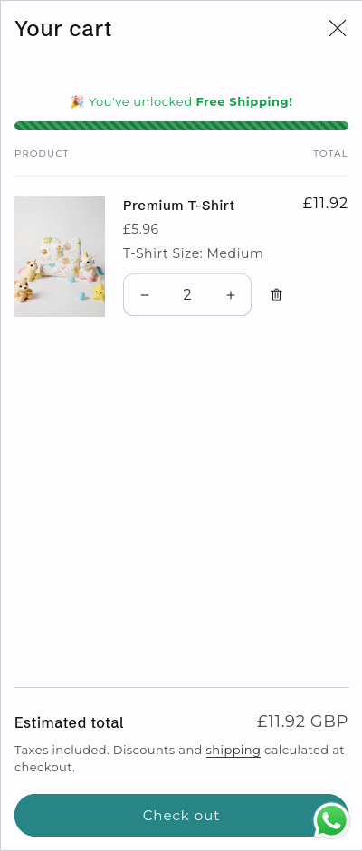
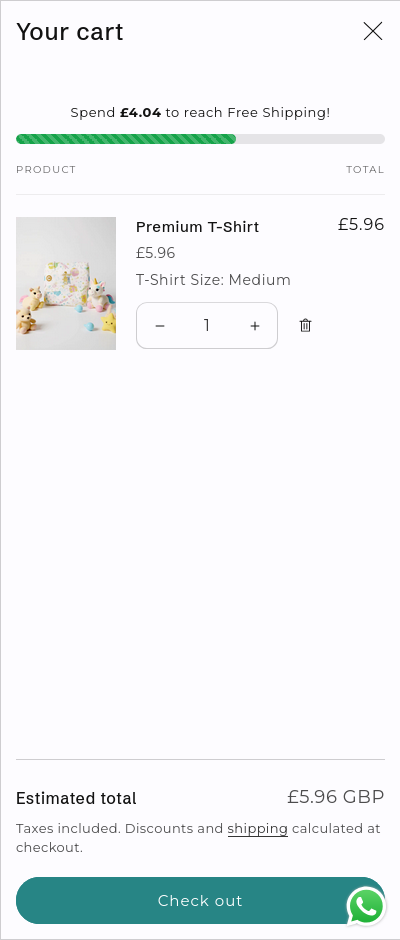
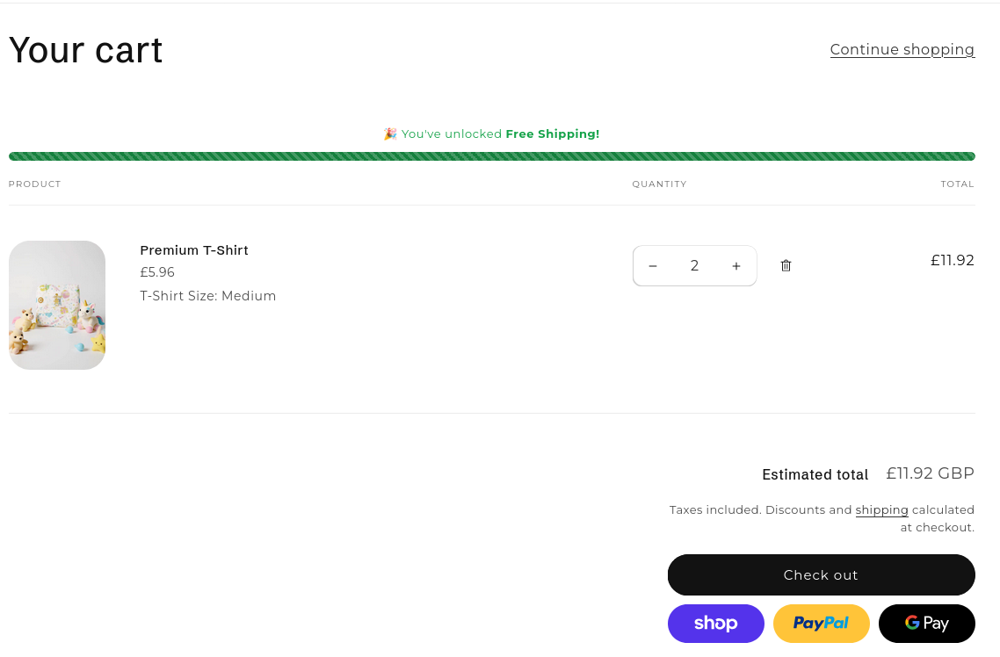

# Shopify Free Shipping Progress Bar (Dawn Theme)

A lightweight, zero-dependency Free Shipping Progress Bar for Shopify OS 2.0 themes (specifically optimized for **Dawn**). 

It features a striped, animated CSS gradient and updates automatically when items are added to the cart or quantities are changed, leveraging Dawn's native AJAX rendering engine without requiring extra JavaScript.

*Matches the design of modern cart drawers with a visual "stripes" animation.*

# Screenshots
## Cart Drawer

## Cart Page

## Features

- **🚀 Lightweight:** Pure Liquid & CSS. No external libraries or jQuery.
- **⚡ Reactive:** Updates instantly when cart quantities change (uses Dawn's `bundled-section-rendering`).
- **🎨 Animated:** Features a smooth, moving striped gradient effect.
- **📱 Responsive:** Works on Cart Drawers, Cart Pages, and Mobile.
- **💰 Currency Aware:** Automatically uses your store's currency formatting.

## Installation

### 1. Create the Snippet
1. In your Shopify Admin, go to **Online Store > Themes > Edit Code**.
2. Under **Snippets**, click **Add a new snippet**.
3. Name it `free-shipping-bar.liquid`.
4. Paste the code from the file in the repo.
5. Save changes.

## Place in Cart Drawer
1. Open Snippets / cart-drawer.liquid.
2. Find the line ``
3. Paste `` above the line.
4. Save changes.

## Place in Cart Page
1. Open `./sections/main-cart-items.liquid`
2. Find the line ``
3. Paste `` above the line.
4. Save changes.

## Configuration
Modify the file `free-shipping-bar.liquid`

` Set this to your amount in CENTS 
 `

## Compatibility

- **Theme:** Designed for **Dawn** (v10+). Should work on any standard Shopify Online Store 2.0 theme (Sense, Craft, Refresh, etc.).
- **Browsers:** Works on all modern browsers.

## License

This project is open source and available under the [MIT License](LICENSE).
